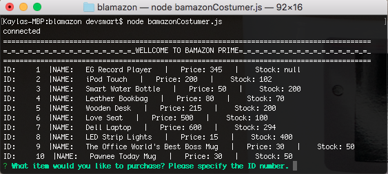
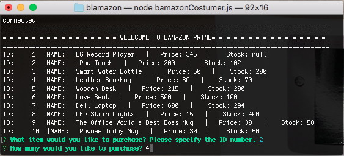
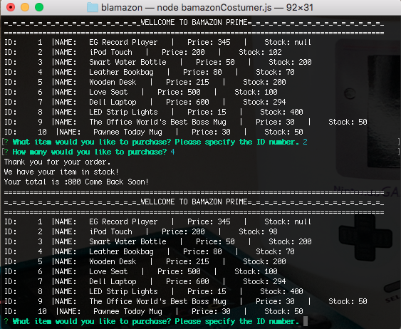

# Bamazon
A Prime Web Store Application 


## Getting Started

The Bamazon CLI application was designed to emulate a webstore , where the user can view the inventory, prices,  and current stock , the user can then succesfully complete a purchase from the store

### What You WIl Need  ( Installing)

-Dowload or Clone the Repository
- In the terminal run the following commands to install the necessary packages 
-Run npm instalation of  mysql 
```
npm install mysql 
```
- Run npm instalation of inquirer

```
npm install inquirer
```

-Running the app 
```
node bamazonCustomer.js
```
-To exit the App
```CTRL + C
```


## Running the tests


1.
``` node bamazonCustomer.js
```
--Displays store Inventory
-- Prompts the user for item selection
--Prompts the user for the desired quantity of the selected item
---The user is shown the total of their purshase if the item is in stock
---If the item is out of stock the app will indicate that the have enterd an insufficient quantity
--After the user recieves either message the app will display an updated inventory list
--- the sql database is also updated with the new stock total 

### Functionality Example


The user is shown  the current  items for sale through the Bamazon web store


### And coding style tests

The user is prompted to respond to two messages about their desired purchase
Each input takes in a number




The user is shown the total price of their item and the updated inventory 




## Technologies Used

* Node.JS
* CLI- Table NPM Package
* MySQL NPM Package
* Inquirer NPM package

## Applications Used
* VSCode Text editor
* MYSQL Workbench
* Terminal
* XCode


## Authors

* **Kayla Smart** - *Week 12* - [PurpleBooth](https://github.com/KaylaSmart)


